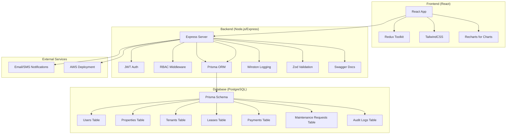

# KABZ Rental Management System - Architecture Plan

## System Overview
KABZ is a full-stack rental management system built with React (frontend), Node.js/Express (backend), and PostgreSQL (database). It supports multiple user roles and comprehensive property management features.

## Technology Stack
- **Backend**: Node.js, Express, Prisma (ORM), PostgreSQL
- **Frontend**: React (Create React App), TailwindCSS, Redux Toolkit
- **Authentication**: JWT with refresh tokens
- **Deployment**: Docker, AWS

## Architecture Diagram

## User Roles
- Admin: Full system access
- Property Manager: Manage properties, tenants, leases
- Landlord: View reports, manage owned properties
- Tenant: View own info, submit maintenance requests

## Core Modules
1. User Management & Authentication
2. Property Management
3. Tenant Management
4. Lease & Rental Agreements
5. Rent Collection & Payments
6. Maintenance Requests
7. Financial Reporting
8. Notifications
9. Audit & Logging

## Development Phases
The implementation will follow the todo list provided, starting with backend scaffolding and progressing through each module.